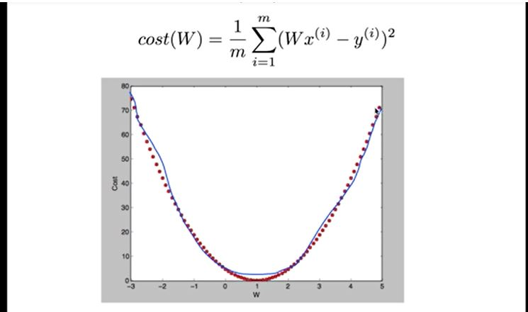
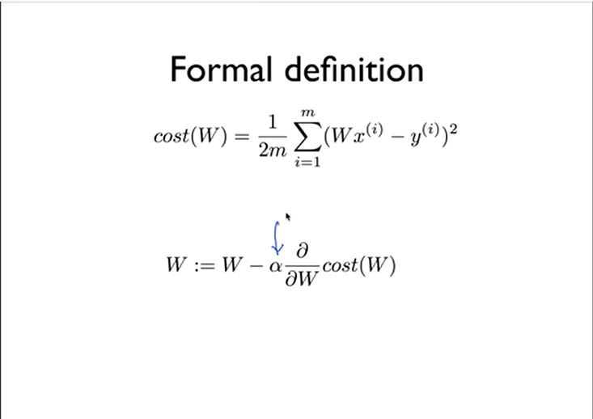
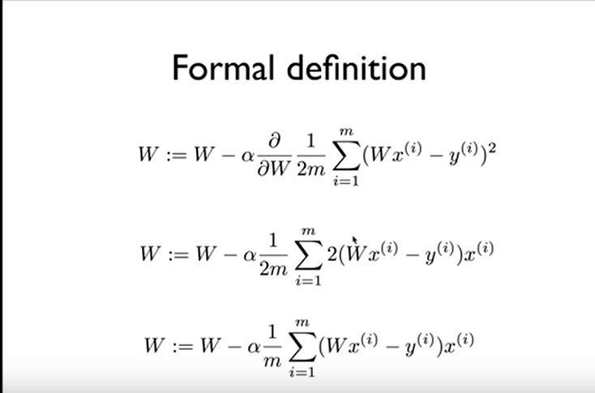
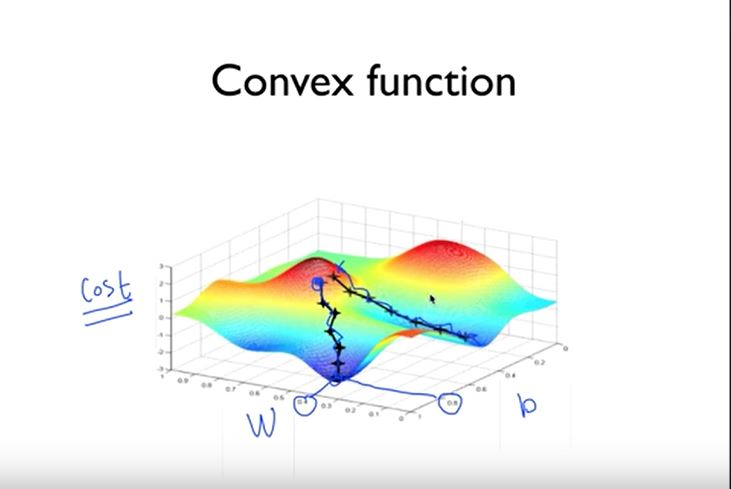
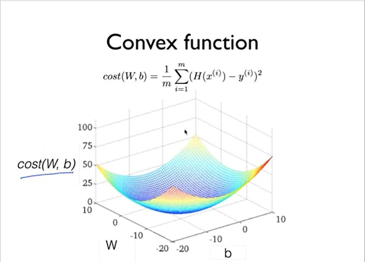

## Lec 03 - Linear Regression의 cost 최소화 알고리즘 설명

  - Lec02 에서 했었던 값들의 cost 그래프
  
  - 이러한 그래프에서 cost값이 최소화된것을 찾아야 함
  - Gradient Descent algorithm(경사하강법) 사용

  ### Gradient Descent algorithm(경사하강법)
  - cost(W,b)가 주어졌을 때 cost를 최소화 하는 W,b를 찾을 수 있음
  - w1,w2...같은 많은 값들이 있는 cost function도 minimize 가능
  - cost function에서 기울기를 계산해 기울기가 가장 작을 때를 찾음(미분을 사용하여 기울기 계산)

  - Gradient Descent algorithm 적용 방법
  
  - 미분 결과

  

   * 주의사항
     - cost function을 3차원으로 그렸을 때 convex funtion이 아니면 정상동작 하지 않음

     - cost funtion모양이 convex funtion이 아닐경우
     
     - cost funtion모양이 convex funtion일 경우
     

## Lab 03 - Linear Regression의 cost 최소화 Tensorflow 구현

  ```python
  import tensorflow as tf

  # tf.Variable : tensorflow가 사용하는 변수(trainable)
  # tf.random_nomal : shape를 결정히고 랜덤한 값으로 초기화
  W = tf.Variable(tf.random_normal([1]), name='weigt')

  # tf.placeholder : 차후에 feed_dict을 사용하여 값을 변경할 수 있음
  x_train = tf.placeholder(tf.float32, shape=[None])
  y_train = tf.placeholder(tf.float32, shape=[None])

  # H(x) = WX
  hypothesis = x_train * W

  # cost = 1/m∑(H(x)^(i) - y^(i))^2
  # tf.reduce_mean : 값을 평균내줌
  # tf.square : 제곱
  cost = tf.reduce_mean(tf.square(hypothesis - y_train))

  # Minimize
  # Gradient Descent algorithm
  # W = W - α*1/m∑(Wx^(i) - y^(i))x^(i)
  learning_rate = 0.1
  gradient = tf.reduce_mean((W * x_train - y_train) * x_train)
  descent = W - learning_rate * gradient
  update = W.assign(descent)
  # 아래 두줄과 같은 코드
  #optimizer = tf.train.GradientDescentOptimizer(learning_rate=0.01)
  #train = optimizer.minimize(cost)

  # Launch the graph in a session
  sess = tf.Session()
  # Initializes global variables in the graph
  sess.run(tf.global_variables_initializer())

  #Fit the Line
  for step in range(21):
      # 설계한 것들중에 최상위 노드(?) 실행
      #sess.run(train)
      sess.run(update,feed_dict={x_train: [1, 2, 3, 4, 5],
                                  y_train: [2, 3, 4, 5, 6]})

      if step % 20 == 0:
          print(step, sess.run(cost, feed_dict={x_train: [1, 2, 3, 4, 5],
                                      y_train: [2, 3, 4, 5, 6]}),sess.run(W))

  ```
